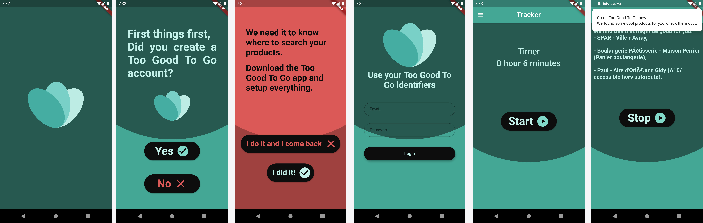

# Too Good To Go Notifier

This repository is the code of an mobile application that informs you periodically if your favorite businesses from your Too Good To Go account have available items.
If so, it sents you a notification.
The app needs to be open constantly.

📱 The app is available here : _link not active yet_

☕ Buy me a coffe : https://paypal.me/4l3x4ndre

## Getting Started

This project is a Flutter application. 

_Warning: It is not an professional product. Some functions in here aren't made by the most "flutterest" way, but comments should keep you on road._

The navigation is super easy. In case, here it how it works:
* Answer yes to the two questions
* Click on the timer to set it up
* Click on _start_ to begin the timer
* After 5 seconds, a first call is made and the result is displayed
* Then, it will call back the api according to your timer's preferences
* Click _stop_ to stop the timer and reset the timer

And that's it, enjoy!

